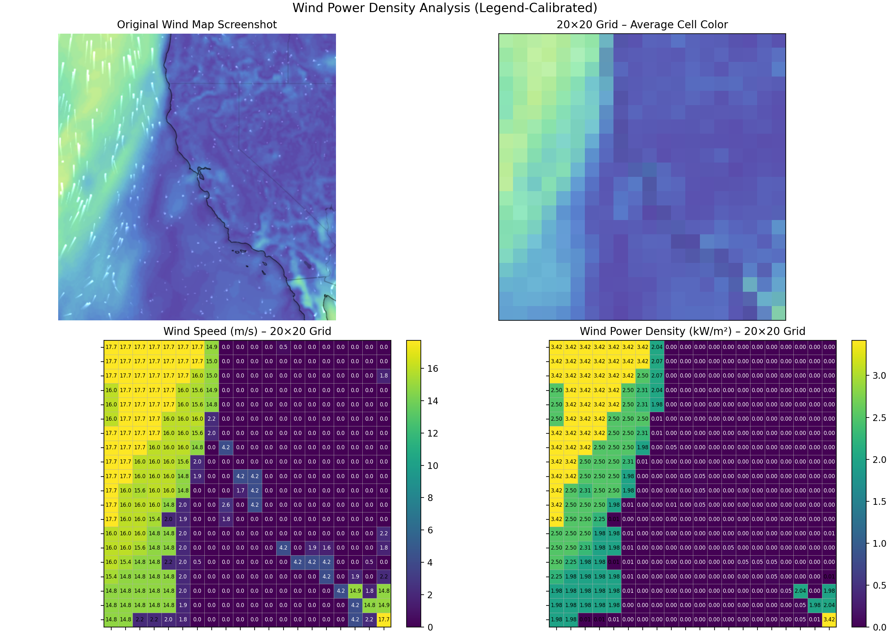

# Module 5 — Wind Energy Assignment

## Wind Power Density Analysis (California & Offshore Regions)

**Course:** A First Course in Renewable Energy
**Program:** UC Berkeley – MASE
**Term:** Spring 2026

---

## 📌 Assignment Context  

This repository contains a **complete, reproducible workflow** for the **Wind Power Density Analysis Project**.
The objective is to convert a **color-coded wind map screenshot** (from Zoom Earth) into **quantitative wind speed and wind power density data**, then present the results using a professional scientific visualization and short interpretation.

This repository is intentionally structured to:

* Maximize **grading alignment** (clear method, correct physics, clear interpretation)
* Demonstrate **engineering rigor** (reproducibility, version control, documentation)
* Serve as the **canonical technical reference** for this assignment

---

## 🔗 Project Navigation

* 🌐 **Step-by-step Methodology (Google Site):**
  [https://sites.google.com/view/renewable-energy2026/module-5](https://sites.google.com/view/renewable-energy2026/module-5)
* 📄 **Final Report (PDF):** Submitted via the course platform (references this repo + Google Site)
* 💻 **Source Code & Outputs:** This GitHub repository

---

## 🎯 What This Project Does 

This project performs the following required steps:

### 1️⃣ Grid-based image processing

* The wind map screenshot is divided into a **20 × 20 grid**
* Each grid cell computes the **average RGB color**

### 2️⃣ Legend-calibrated wind speed extraction

* Grid-cell RGB values are mapped to wind speed (mph) using the **legend colorbar** from the screenshot
* Wind speed is converted to SI units:

[
v_{m/s} = v_{mph} \times 0.44704
]

### 3️⃣ Wind power density calculation

Wind power density is computed per grid cell using:

[
P = \frac{1}{2} \rho v^3 / 1000
]

Where:

* ( \rho = 1.225 , \text{kg/m}^3 ) (air density)
* ( v ) = wind speed (m/s)
* Output units: **kW/m²**

### 4️⃣ Scientific visualization

A single **2 × 2 figure** is generated:

1. Original wind map screenshot
2. 20×20 grid showing average cell color
3. Wind speed map (m/s)
4. Wind power density map (kW/m²)

### 5️⃣ Summary statistics

* Minimum, mean, and maximum values for:

  * Wind speed (m/s)
  * Wind power density (kW/m²)

---

## 🗂️ Repository Structure

```
.
├── README.md
├── requirements.txt
├── data/
│   └── raw/
│       └── (wind map screenshots)
├── src/
│   ├── main_analysis.py
│   └── ui_runner.py
└── outputs/
    ├── figures/
    │   └── wind_4panel.png
    └── tables/
        └── summary_stats.csv
```

---

## 🖼️ Results Preview (Displayed Directly on GitHub)

### Final 4-Panel Figure



### Summary Statistics

The numerical summary is saved as:

* `outputs/tables/summary_stats.csv`

All result files are committed to the repository so they can be viewed directly on GitHub.

---

## 🧰 Tools & Technologies

* **Python 3.11**
* **NumPy** – numerical computation
* **Matplotlib** – scientific visualization
* **Pillow (PIL)** – image loading and processing
* **Anaconda** – environment management
* **Git & GitHub** – version control and reproducibility

---

## ⚙️ Environment Setup (Windows CMD)

### 1️⃣ Create and activate the environment

```bash
conda create -n wind_m5 python=3.11
conda activate wind_m5
```

### 2️⃣ Install dependencies

```bash
pip install -r requirements.txt
```

---

## ▶️ How to Run the Project

### Option A — UI Workflow (Beginner-Friendly)

A graphical interface allows image selection, legend selection, and execution without manual coordinate entry.

```bash
conda activate wind_m5
python src/ui_runner.py
```

**UI Steps:**

1. Select a wind map screenshot
2. Drag a box around the **legend colorbar only**
3. Run the analysis
4. Outputs are saved automatically to `outputs/`

---

### Option B — Command-Line Execution

```bash
conda activate wind_m5
python src/main_analysis.py --image data/raw/your_screenshot.png --legend X1 Y1 X2 Y2 --mph-min 0 --mph-max 40
```

Legend coordinates must tightly bound the colorbar. mph-min and mph-max should match the legend values shown in the screenshot.

---

## 📌 Interpretation Notes (For Report)

Key findings typically observed:

* Offshore regions exhibit **higher wind speeds and power densities** than inland regions
* Wind power density scales with **velocity cubed (v³)**, so small speed increases lead to large power increases
* Near-zero values may occur in grid cells affected by map labels or UI overlays

---

## ⚠️ Assumptions & Limitations

* Wind speeds are estimated from **color-to-value mapping** and are approximate
* Spatial resolution is limited to a 20×20 grid
* Map labels and overlays are not masked
* Results are intended for **educational and comparative analysis**, not site-specific engineering design

---

## ✅ Reproducibility Checklist

* [x] Reproducible environment (`requirements.txt`)
* [x] Source code committed (`src/`)
* [x] Input images stored or selected via UI
* [x] Outputs generated and committed (`outputs/`)
* [x] Results referenced in PDF and Google Site

---

## 👤 Author

Prepared by **Aryan Yaghobi**
UC Berkeley – MASE
Spring 2026
